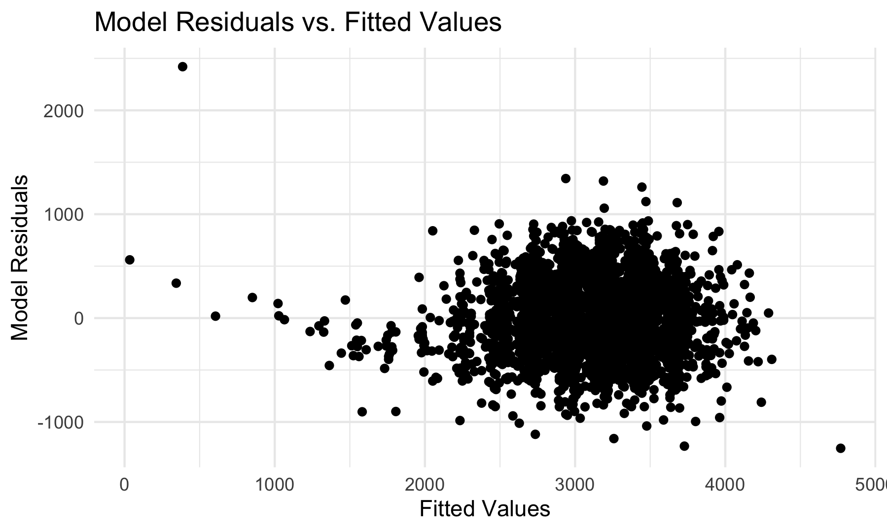

```{r setup, include=FALSE}
library(tidyverse)

knitr::opts_chunk$set(
  fig.width = 6,
  fig.asp = .6,
  out.width = "90%"
)

theme_set(theme_minimal() + theme(legend.position = "bottom"))

options(
  ggplot2.continuous.colour = "viridis",
  ggplot2.continuous.fill = "viridis"
)

scale_colour_discrete = scale_colour_viridis_d
scale_fill_discrete = scale_fill_viridis_d
```

### Problem 1

## Load and Clean the Birthweight Data

```{r}
birthweight_data = read_csv("./birthweight.csv") %>% 
  janitor::clean_names() %>% 
  mutate(
    babysex = as.factor(babysex),
    frace = as.factor(frace),
    malform = as.factor(malform),
    mrace = as.factor(mrace)
  ) %>% 
  select(
    -pnumlbw,
    -pnumsga
  )
```

## Model Building

```{r}
birthweight_model1 = lm(bwt ~ wtgain + bhead, data = birthweight_data)

birthweight_model2 = lm(bwt ~ wtgain + fincome, data = birthweight_data)

birthweight_model3 = lm(bwt ~ wtgain + mrace, data = birthweight_data)

birthweight_model4 = lm(bwt ~ wtgain + gaweeks, data = birthweight_data)

birthweight_model1 %>% broom::glance()
birthweight_model2 %>% broom::glance()
birthweight_model3 %>% broom::glance()
birthweight_model4 %>% broom::glance()
```

I am interested in how maternal weight gain affects a baby's weight a birth, so I proposed four models for baby's birth weight using the mother's weigth gain plus one other predictor in each case. Of the four, I am going to proceed using birthweight_model1, which used mother's weight gain and baby's head circumference as predictors, since that model had the highest R-squared value of 0.571, while the other models had significantly smaller R-squared valued, indicating those models are worse fits at predicting baby birthweight.

## Plot of Model Residuals vs. Fitted Values

```{r}
resid_vs_fitted_plot = birthweight_data %>% 
  modelr::add_residuals(birthweight_model1) %>% 
  modelr::add_predictions(birthweight_model1) %>% 
  ggplot(aes(x = pred, y = resid)) +
  geom_point()

ggsave("resid_vs_fitted_plot.png")

```

## Two Other Models for Comparison

```{r}

```


