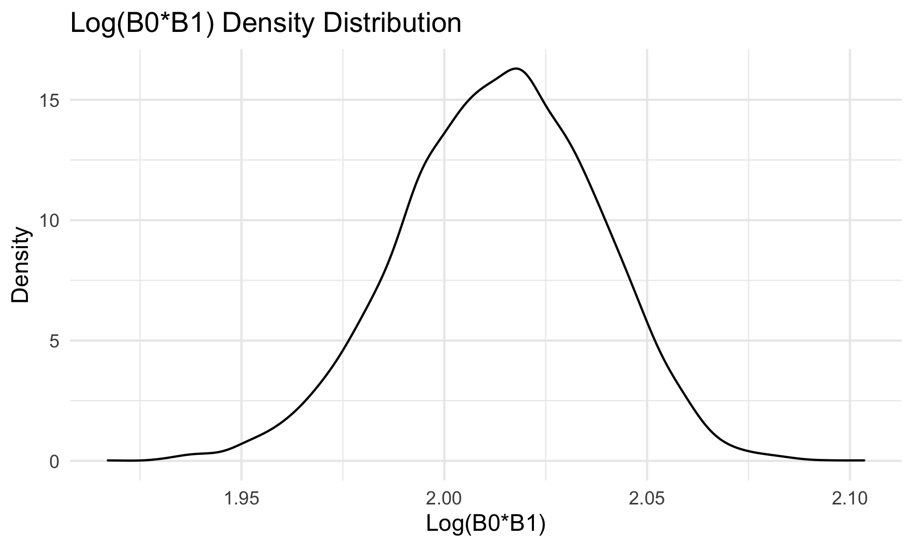

```{r setup, include = FALSE}
library(tidyverse)
library(modelr)

knitr::opts_chunk$set(
  fig.width = 6,
  fig.asp = .6,
  out.width = "90%"
)

theme_set(theme_minimal() + theme(legend.position = "bottom"))

options(
  ggplot2.continuous.colour = "viridis",
  ggplot2.continuous.fill = "viridis"
)

scale_colour_discrete = scale_colour_viridis_d
scale_fill_discrete = scale_fill_viridis_d
```

### Problem 1

## Load and Clean the Birthweight Data

```{r, message = FALSE}
birthweight_data = read_csv("./birthweight.csv") %>% 
  janitor::clean_names() %>% 
  mutate(
    babysex = as.factor(babysex),
    frace = as.factor(frace),
    malform = as.factor(malform),
    mrace = as.factor(mrace)
  ) %>% 
  select(
    -pnumlbw,
    -pnumsga
  )
```

## Model Building

```{r}
birthweight_model1 = lm(bwt ~ wtgain + bhead, data = birthweight_data)

birthweight_model2 = lm(bwt ~ wtgain + fincome, data = birthweight_data)

birthweight_model3 = lm(bwt ~ wtgain + mrace, data = birthweight_data)

birthweight_model4 = lm(bwt ~ wtgain + gaweeks, data = birthweight_data)

birthweight_model1 %>% broom::glance()
birthweight_model2 %>% broom::glance()
birthweight_model3 %>% broom::glance()
birthweight_model4 %>% broom::glance()
```

I am interested in how maternal weight gain affects a baby's weight a birth, so I proposed four models for baby's birth weight using the mother's weigth gain plus one other predictor in each case. Of the four, I am going to proceed using birthweight_model1, which used mother's weight gain and baby's head circumference as predictors, since that model had the highest R-squared value of 0.571, while the other models had significantly smaller R-squared valued, indicating those models are worse fits at predicting baby birthweight.

## Plot of Model Residuals vs. Fitted Values

```{r, message = FALSE}
resid_vs_fitted_plot = birthweight_data %>% 
  add_residuals(birthweight_model1) %>% 
  add_predictions(birthweight_model1) %>% 
  ggplot(aes(x = pred, y = resid)) +
  geom_point()

ggsave("resid_vs_fitted_plot.png")
knitr::include_graphics("resid_vs_fitted_plot.png")
```

## Two Other Models for Comparison

```{r}
length_and_ga_model = lm(bwt ~ blength + gaweeks, data = birthweight_data)

circ_length_sex_model = lm(bwt ~ bhead * blength + bhead * babysex + blength * babysex + bhead * blength * babysex, data = birthweight_data)
```

## Cross Validation

```{r, message = FALSE}
cv_plot =
  crossv_mc(birthweight_data, 100) %>% 
  mutate(
    wtgain_bhead = map(train, ~birthweight_model1),
    length_ga  = map(train, ~length_and_ga_model),
    circ_length_sex  = map(train, ~circ_length_sex_model)
    )%>% 
  mutate(
    rmse_wtgain_bhead = map2_dbl(wtgain_bhead, test, ~rmse(model = .x, data = .y)),
    rmse_length_ga = map2_dbl(length_ga, test, ~rmse(model = .x, data = .y)),
    rmse_circ_length_sex = map2_dbl(circ_length_sex, test, ~rmse(model = .x, data = .y))
          ) %>% 
  select(starts_with("rmse")) %>% 
  pivot_longer(
    everything(),
    names_to = "model", 
    values_to = "rmse",
    names_prefix = "rmse_") %>% 
  mutate(model = fct_inorder(model)) %>% 
  ggplot(aes(x = model, y = rmse)) +
  geom_violin()

ggsave("cv_plot.png")

```

### Problem 3

## Read in Data

```{r}
weather_df = 
  rnoaa::meteo_pull_monitors(
    c("USW00094728"),
    var = c("PRCP", "TMIN", "TMAX"), 
    date_min = "2017-01-01",
    date_max = "2017-12-31") %>%
  mutate(
    name = recode(id, USW00094728 = "CentralPark_NY"),
    tmin = tmin / 10,
    tmax = tmax / 10) %>%
  select(name, id, everything())
```

## Bootstrapping

```{r}
bootstrap_weather = 
  weather_df %>% 
  modelr::bootstrap(n = 5000) %>% 
  mutate(
    models = map(strap, ~lm(tmax ~ tmin, data = .x)),
    results1 = map(models, broom::glance),
    results2 = map(models, broom::tidy)
    ) %>% 
  select(-strap, -models) %>% 
  unnest(results2) %>% 
  select(-std.error, -statistic, -p.value) %>% 
  pivot_wider(names_from = term, values_from = estimate) %>% 
  unnest(results1) %>% 
  janitor::clean_names() %>% 
  select(id, r_squared, intercept, tmin) %>% 
  mutate(
    log_var = log(intercept * tmin)
  ) %>% 
  select(-intercept, -tmin)
```

## Bootstrapped Variable Distributions

```{r, message = FALSE}
bootstrap_r_square_distribution =
  bootstrap_weather %>% 
  ggplot(aes(x = r_squared)) +
  geom_density()

ggsave("bootstrap_r_square_distribution.png")
knitr::include_graphics("bootstrap_r_square_distribution.png")

bootstrap_log_var_distribution =
  bootstrap_weather %>% 
  ggplot(aes(x = log_var)) +
  geom_density()

ggsave("bootstrap_log_var_distribution.png")

```


## Bootstrap Quantiles

```{r}
r_squared_quantiles = bootstrap_weather %>% 
  group_by(id) %>% 
  summarize(
    ci_lower = quantile(r_squared, 0.025),
    ci_upper = quantile(r_squared, 0.975)
  )

log_var_quantiles = bootstrap_weather %>% 
  group_by(id) %>% 
  summarize(
    ci_lower = quantile(log_var, 0.025),
    ci_upper = quantile(log_var, 0.975)
  )
```

