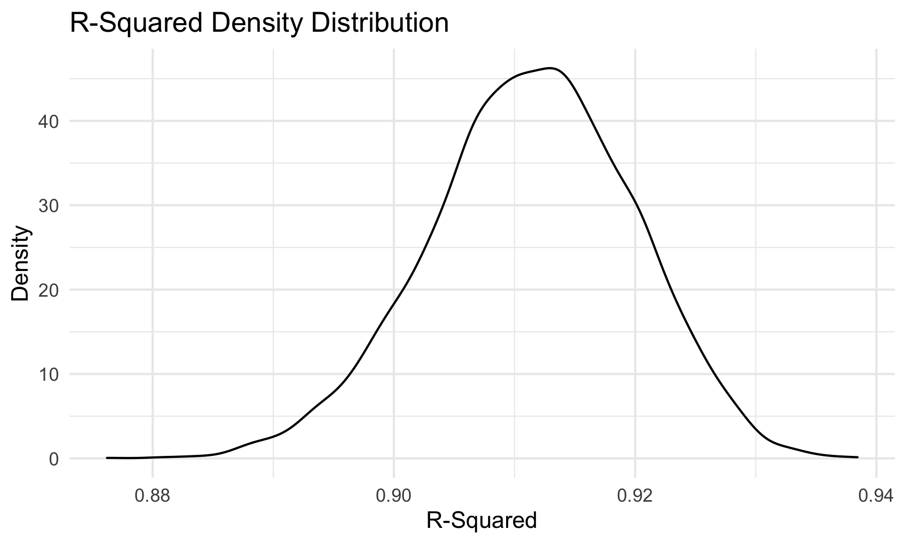

p8105\_hw6\_mjn2142
================
Matthew Neky
12/4/2021

### Problem 1

## Load and Clean the Birthweight Data

``` r
birthweight_data = read_csv("./birthweight.csv") %>% 
  janitor::clean_names() %>% 
  mutate(
    babysex = as.factor(babysex),
    frace = as.factor(frace),
    malform = as.factor(malform),
    mrace = as.factor(mrace)
  ) %>% 
  select(
    -pnumlbw,
    -pnumsga
  )
```

## Model Building

``` r
birthweight_model1 = lm(bwt ~ wtgain + bhead, data = birthweight_data)

birthweight_model2 = lm(bwt ~ wtgain + fincome, data = birthweight_data)

birthweight_model3 = lm(bwt ~ wtgain + mrace, data = birthweight_data)

birthweight_model4 = lm(bwt ~ wtgain + gaweeks, data = birthweight_data)

birthweight_model1 %>% broom::glance()
```

    ## # A tibble: 1 × 12
    ##   r.squared adj.r.squared sigma statistic p.value    df  logLik    AIC    BIC
    ##       <dbl>         <dbl> <dbl>     <dbl>   <dbl> <dbl>   <dbl>  <dbl>  <dbl>
    ## 1     0.571         0.571  336.     2885.       0     2 -31413. 62833. 62859.
    ## # … with 3 more variables: deviance <dbl>, df.residual <int>, nobs <int>

``` r
birthweight_model2 %>% broom::glance()
```

    ## # A tibble: 1 × 12
    ##   r.squared adj.r.squared sigma statistic  p.value    df  logLik    AIC    BIC
    ##       <dbl>         <dbl> <dbl>     <dbl>    <dbl> <dbl>   <dbl>  <dbl>  <dbl>
    ## 1    0.0863        0.0859  490.      205. 9.77e-86     2 -33053. 66114. 66139.
    ## # … with 3 more variables: deviance <dbl>, df.residual <int>, nobs <int>

``` r
birthweight_model3 %>% broom::glance()
```

    ## # A tibble: 1 × 12
    ##   r.squared adj.r.squared sigma statistic   p.value    df  logLik    AIC    BIC
    ##       <dbl>         <dbl> <dbl>     <dbl>     <dbl> <dbl>   <dbl>  <dbl>  <dbl>
    ## 1     0.149         0.148  473.      189. 9.98e-150     4 -32899. 65811. 65849.
    ## # … with 3 more variables: deviance <dbl>, df.residual <int>, nobs <int>

``` r
birthweight_model4 %>% broom::glance()
```

    ## # A tibble: 1 × 12
    ##   r.squared adj.r.squared sigma statistic   p.value    df  logLik    AIC    BIC
    ##       <dbl>         <dbl> <dbl>     <dbl>     <dbl> <dbl>   <dbl>  <dbl>  <dbl>
    ## 1     0.205         0.205  457.      561. 2.78e-217     2 -32750. 65507. 65533.
    ## # … with 3 more variables: deviance <dbl>, df.residual <int>, nobs <int>

I am interested in how maternal weight gain affects a baby’s weight a
birth, so I proposed four models for baby’s birth weight using the
mother’s weigth gain plus one other predictor in each case. Of the four,
I am going to proceed using birthweight\_model1, which used mother’s
weight gain and baby’s head circumference as predictors, since that
model had the highest R-squared value of 0.571, while the other models
had significantly smaller R-squared valued, indicating those models are
worse fits at predicting baby birthweight.

## Plot of Model Residuals vs. Fitted Values

``` r
resid_vs_fitted_plot = birthweight_data %>% 
  add_residuals(birthweight_model1) %>% 
  add_predictions(birthweight_model1) %>% 
  ggplot(aes(x = pred, y = resid)) +
  geom_point() +
  labs(
    title = "Model Residuals vs. Fitted Values",
    x = "Fitted Values",
    y = "Model Residuals"
  )

ggsave("resid_vs_fitted_plot.png")
knitr::include_graphics("resid_vs_fitted_plot.png")
```


Plots of model residuals vs. fitted values should show points plotted
roughly evenly both above and below 0, which this plot demonstrates, as
the plotted points are bound around 0.

## Two Other Models for Comparison

``` r
length_and_ga_model = lm(bwt ~ blength + gaweeks, data = birthweight_data)

circ_length_sex_model = lm(bwt ~ bhead * blength + bhead * babysex + blength * babysex + bhead * blength * babysex, data = birthweight_data)
```

## Cross Validation

``` r
cv_plot =
  crossv_mc(birthweight_data, 100) %>% 
  mutate(
    wtgain_bhead = map(train, ~birthweight_model1),
    length_ga  = map(train, ~length_and_ga_model),
    circ_length_sex  = map(train, ~circ_length_sex_model)
    )%>% 
  mutate(
    rmse_wtgain_bhead = map2_dbl(wtgain_bhead, test, ~rmse(model = .x, data = .y)),
    rmse_length_ga = map2_dbl(length_ga, test, ~rmse(model = .x, data = .y)),
    rmse_circ_length_sex = map2_dbl(circ_length_sex, test, ~rmse(model = .x, data = .y))
          ) %>% 
  select(starts_with("rmse")) %>% 
  pivot_longer(
    everything(),
    names_to = "model", 
    values_to = "rmse",
    names_prefix = "rmse_") %>% 
  mutate(model = fct_inorder(model)) %>% 
  ggplot(aes(x = model, y = rmse)) +
  geom_violin() +
  labs(
    title = "Violin Plots of RMSE for Different Linear Models of Birth Weight",
    x = "Model",
    y = "RMSE"
  )

ggsave("cv_plot.png")
knitr::include_graphics("cv_plot.png")
```


The cross validation analysis using violion plots of RMSE distribution
to compare linear models predicting birth weight shows that the model
that uses baby’s head circumference, length at birth, and sex (and all
of their interactions), performs better than my proposed model as well
as that of length and gestational age at predicting birth weight, in
terms of RMSE, since the circumference/length/sex model has the smallest
RMSE.

### Problem 3

## Read in Data

``` r
weather_df = 
  rnoaa::meteo_pull_monitors(
    c("USW00094728"),
    var = c("PRCP", "TMIN", "TMAX"), 
    date_min = "2017-01-01",
    date_max = "2017-12-31") %>%
  mutate(
    name = recode(id, USW00094728 = "CentralPark_NY"),
    tmin = tmin / 10,
    tmax = tmax / 10) %>%
  select(name, id, everything())
```

## Bootstrapping

``` r
bootstrap_weather = 
  weather_df %>% 
  modelr::bootstrap(n = 5000) %>% 
  mutate(
    models = map(strap, ~lm(tmax ~ tmin, data = .x)),
    results1 = map(models, broom::glance),
    results2 = map(models, broom::tidy)
    ) %>% 
  select(-strap, -models) %>% 
  unnest(results2) %>% 
  select(-std.error, -statistic, -p.value) %>% 
  pivot_wider(names_from = term, values_from = estimate) %>% 
  unnest(results1) %>% 
  janitor::clean_names() %>% 
  select(id, r_squared, intercept, tmin) %>% 
  mutate(
    log_var = log(intercept * tmin)
  ) %>% 
  select(-intercept, -tmin)
```

## Bootstrapped Variable Distributions

``` r
bootstrap_r_square_distribution =
  bootstrap_weather %>% 
  ggplot(aes(x = r_squared)) +
  geom_density() +
  labs(
    title = "R-Squared Density Distribution",
    x = "R-Squared",
    y = "Density"
  )

ggsave("bootstrap_r_square_distribution.png")

```


``` r
bootstrap_log_var_distribution =
  bootstrap_weather %>% 
  ggplot(aes(x = log_var)) +
  geom_density() +
  labs(
    title = "Log(B0*B1) Density Distribution",
    x = "Log(B0*B1)",
    y = "Density"
  )

ggsave("bootstrap_log_var_distribution.png")
knitr::include_graphics("bootstrap_log_var_distribution.png")
```


The density distributions for both r-squared and log(B0\*B1) appear to
approximately follow a normal distribution.

## Bootstrap Quantiles

``` r
r_squared_quantiles = bootstrap_weather %>% 
  summarize(
    ci_lower = quantile(r_squared, 0.025),
    ci_upper = quantile(r_squared, 0.975)
  )

knitr::kable(r_squared_quantiles)
```

| ci\_lower | ci\_upper |
|----------:|----------:|
| 0.8938544 | 0.9270626 |

``` r
log_var_quantiles = bootstrap_weather %>% 
  summarize(
    ci_lower = quantile(log_var, 0.025),
    ci_upper = quantile(log_var, 0.975)
  )

knitr::kable(log_var_quantiles)
```

| ci\_lower | ci\_upper |
|----------:|----------:|
|  1.964317 |  2.057966 |

The confidence interval for r-squared is (0.894, 0.927) and the
confidence interval for log(B0\*B1) is (1.965, 2.059).
